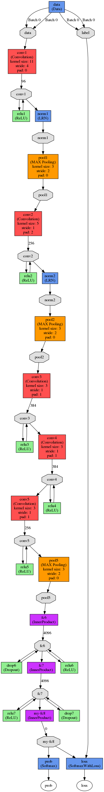
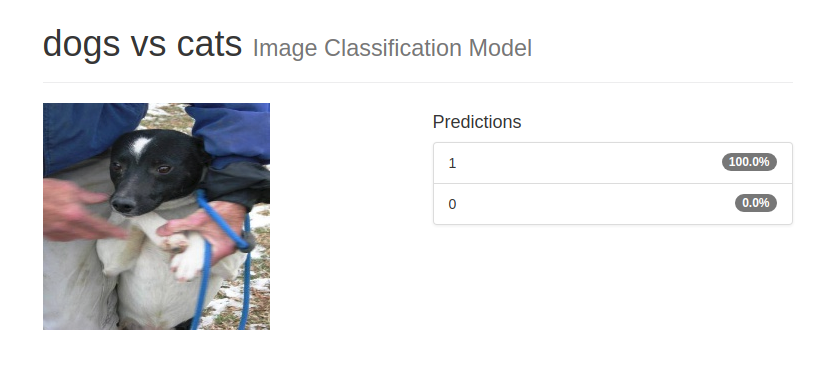
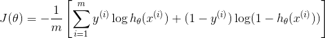
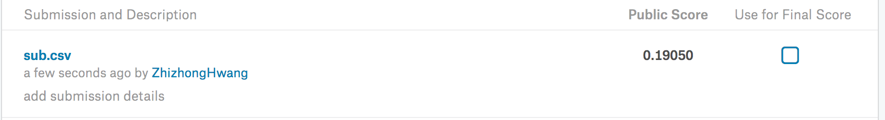

#### Dogs VS Cats.

GitHub地址：https://github.com/Hzzone/Dogs-vs-Cats

做Deep Learning, 首先接触第一个项目必是mnist手写体数据集，再然后的可以是很多，但是猫狗分类肯定是最有名的。 
Dogs VS Cats.最初开始于Kaggle上的一个竞赛，数据集下载[dogs-vs-cats/data](https://www.kaggle.com/c/dogs-vs-cats/data).
##### 目标
在AlexNet上Finetuning猫狗分类。
##### 数据集预览
数据集一共有25000张训练集，12500张测试集，每张的大小不定。在这里数据预处理，我就简单的resize到统一的尺寸，227*227,Caffe训练好的AlexNet model接受的大小。
```python
def resize(source):
	files = os.listdir(source)
	for im_file in files:
		path = osp.join(source, im_file)
		im = cv2.resize(cv2.imread(path), (227, 227))	
		cv2.imwrite(path, im)
		print path
```


##### 开始
在这里，我将会使用Nvidia为Deep Learning推出的一款可视化工具：[Digits](https://github.com/NVIDIA/DIGITS)，支持TensorFlow, Caffe, PyTorch等框架。这里用他的原因比较简单，因为可以可视化，展示也非常直观（缺点是定制难，可以想象的是和Dreamweaver一样，使用和效果都不太好，适合新手，有需求的话还是用原生的）。  
首先将数据进行分类，0代表cat, 1代表dog, dog的图片和cat的图片分别在0和1的文件夹，train文件夹下直接以下python代码：
```python
import os
import shutil
import os.path as osp
def move(source):
    file_list = os.listdir(source)
    dog_files = []
    cat_files = []
    os.mkdir(osp.join(source, str(0)))
    os.mkdir(osp.join(source, str(1)))
    for image_file in file_list:
        opt = image_file.split(".")[0]
        opt = 1 if opt=='dog' else 0
        shutil.move(osp.join(source, image_file), osp.join(source, str(opt)))


if __name__ == "__main__":
    move("/Users/HZzone/Downloads/train")
```
分类好之后，由于Kaggle上没有开放过测试集的标签，需要将预测结果保存到csv文件提交到另一个kernel版本上, [提交链接](https://www.kaggle.com/c/dogs-vs-cats-redux-kernels-edition/submit). 
digits中的网络结构和原生caffe稍有不同,参考[train_val.prototxt](./train_val.prototxt).网络结构如下:   

##### 训练
环境：Ubuntu 16.04/caffe/digits/1080Ti     
下载好[model](https://github.com/BVLC/caffe/tree/master/models/bvlc_alexnet)之后，修改最后一层分类器为my-fc8, 其他的都很简单。

##### 训练完成后进行预测
* 预测单张图片
  digits 支持直接上传单张图片进行预测,效果如下(0代表猫,1代表狗):     
  

* 预测所有测试集
  digits也支持, 但是不能导出, 参考[boring.py](./boring.py)的代码. 

score是logloss, 由于logloss的公式是这样的:

我直接submit到Kaggle上, 并且提交的label是狗的概率。 结果如下:

